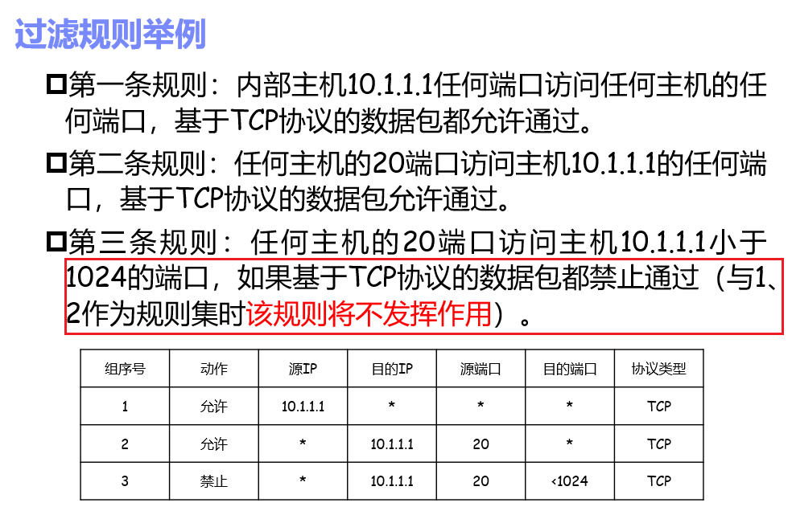
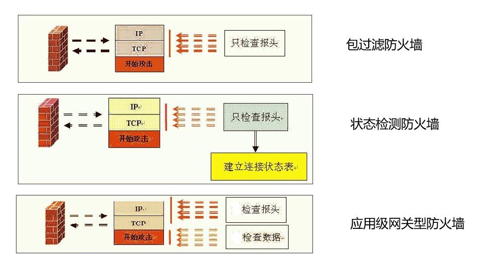
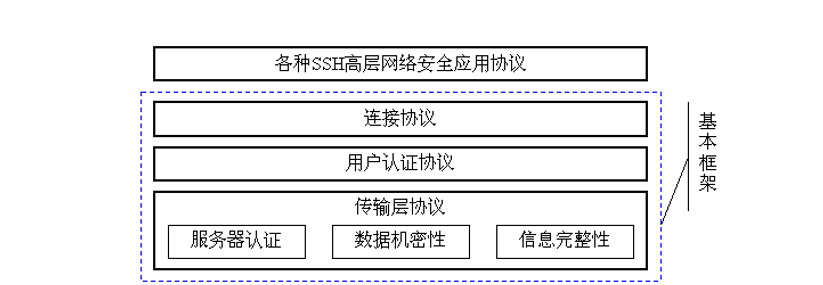

# 网络安全协议

## 概述

### 概念

常见的不安全因素： 

- 物理因素：物理设备的不安全，电磁波泄漏等 
- 系统因素：系统软、硬件漏洞，病毒感染，入侵 
- 网络因素：**网络协议漏洞，会话劫持、数据篡改，网络拥塞，拒绝服务 **
- 管理因素：管理员安全意识淡漠，误操作

不安全的原因： 

- 自身的缺陷：系统软硬件缺陷、网络协议的缺陷 开放性 
- 系统开放：
-  业务开放：用户可以根据需要开发新的业务 
- 黑客攻击

**6大网络安全特征：**

- 机密性**C**：信息不泄露给非授权的用户、实体或过程的特性
- 完整性**I**：数据再未经授权的过程中不能被改变
- 可用性**A**：可被授权的实体访问并按需求使用的特性
- 可认证性：要求数据来自所声称的实体
- 不可否认性：做过的行为不能被抵赖
- 可控制性：对网络信息的传播以及内容具有控制能力

常见的攻击手段：社会工程、口令破解、地址欺骗、连接盗用、网络窃听、数据篡改、恶意扫描、基础设施破 坏、拒绝服务、数据驱动攻击。总的来说有：

- 中断：破坏可用性
- 窃听：破坏机密性
- 修改：破坏完整性
- 伪造：破坏了可认证性

### 网络参考模型于安全模型

网络参考模型

- ISO-OSI模型
- TCP/IP模型（IETF）

网络安全体系结构：（ITU的X.800和IETF的RFC2828）

- 安全攻击
- 安全机制
- 安全服务

用一种或多种安全机制来实现安全服务， 安全服务致力于抵御安全攻击。

**安全攻击：**

- 主动攻击：更改数据流，制造假的数据流
  - 伪装
  - 重放
  - 篡改
  - 拒绝服务
- 被动攻击：对传输进行偷听于监视，获得传输信息，但是不对通信和数据做任何修改
  - 窃听攻击
  - 流量分析
  - 破解弱加密数据流
- 区别：会不会主动改变数据流

**安全机制** 

- 加密
- 数字签名
- 访问控制
- 数据完整性
- 认证交换
- 流量填充
- 路由控制
- 公证

**安全服务**：X.800定义了5类14种安全服务

- 认证
  - 对等实体认证
    - 实现的安全机制：加密、数字签名、认证
  - 数据源认证
    - 实现的安全机制：加密，数字签名
  - 区别：对等实体认证关注通信双方的身份认证，数据源认证关注于数据的来源是否是可信的。
- 访问控制
  - 实现的安全机制：访问控制
- 数据的机密性：连接保密性、无连接保密性、选择域保密性、流量保密性
- 数据的完整性
  - 实现的安全机制：加密，数字签名，完整性
- 不可否认性
  - 数字签名，完整性，公证

### 安全模型

**网络安全模型：实现端到端的安全通信**

-  可信第三方制定规则约束信息
- 发送接收和传输信息通过安全可靠的方式进行转化后传输
- 保证身份认证, 信息机密性, 完整性, 不可否认性

**网络访问安全模型：保护系统免受恶意访问**

- 保护信息系统免遭恶意访问
  - 防火墙和安全网关
  - 入侵检测系统 
  - 虚拟专用网
- 保证网络的可用性, 可控性

### 网络各层的安全协议

- 数据链路层
  - 连路隧道协议
  - 加密技术

- 网络层
  - 包过滤机制  
  - NAT 
  -  IPsec
  -   VPN

- 传输层
  - SSL/TLS

- 应用层
  - HTTPS
  - PGP
  - S/MIME
  - DNSSEC

### 密码学基础知识

对称密码的问题

- 潜在通信的两两分别用一对密钥，当用户量增大时，密钥空间急剧增大。
- 无法实现抗否认需求（数字签名）

非对称密码体制的基本原则

- 需要保存的密钥量大大减少，N个用户只需要N个，除了个人私钥之外，公钥均可以公开保存
- 密钥分发简单，可以实现数字签名
- 加密与解密能力分开
- 可以实现不相识的两个人之间通信（对称加密不可以，因为需要有密钥）

#### RSA密码体制的基本原理

选择p,q均为素数，计算$φ(n)=(p-1)(q-1)$，选择整数e与$φ(n)$互素，即$gcd(φ(n),e)=1$,1<e<φ (n) 计算d,使$de=1(modφ (n))$

**公钥Pk={e, n}**;

**私钥Sk={d, n}**

**A会发布他的公钥，B使用A的公钥加密，把加密信息发给A,然后A用它的私钥解密**

#### DH密钥交换

让两个用户能安全的交换密钥，以供加密来使用。

Alice和Bob共享一个素数q和a

Alice生成一个**私钥**$X_A$，然后计算**公钥**$Y_A=a^{X_A}$,将公钥发给Bob。

同理Bob发给Alice公钥$Y_B$

密钥$K=Y_B^{X_A}=Y_A^{X_B}$

容易受到中间人攻击：具体而言就是出现一个中间人Eve，截获双方公钥，并自己产生两个假公钥，发送给Alice和Bob,因此实际上，通信的双方都是在和中间人通话。

这一问题可以由数字签名和公钥证书来解决。

### 数字签名和认证

#### 数字签名

- 数字签名用于实现消息的不可否认性
- 消息认证用于实现消息的完整性

**数字签名就是利用私钥生成签名，而用公钥验证签名。**具体而言，就是签名算法利用私钥生成签名，称消息m的签名为sig（m），然后将（m，sig（m））发给接收方。验证算法利用签名者的公钥对sig（m）进行解密，如果解密输出与m一致，则为合法数据。

**由于无法识别数字签名和它的拷贝之间的差异，可能导致重放攻击，因此我们应该加上一个时间戳**

- DSS数字签名标准
  - DSA数字签名算法
  - RSA

**实际操作是先hash，再进行签名算法，这样能同时保证数据的完整性和不可否认性**

#### 消息认证

**消息认证用于提供数据源的认证能力（注意是数据源的，不是端对端的）**

可以用于做消息认证的函数有三类

- 直接加密
  - 对称加密，信息的一致作为对信息的认证
  - 使用公钥密码中的私钥加密（如果要验证，使用私钥加密，如果加密，需要使用公钥加密。），**实际使用中，为了避免加密速度太慢，使用的时候，会结合散列函数构成实用化的签名**
- 消息认证码（MAC）
  - 以消息和密钥作为输入，定长输出
- 散列函数+签名
  - 公开的函数进行计算摘要生成定长信息, 需结合公钥签名。使用取散列之后签名附在消息后。

首先明确消息验证码和散列函数的区别，消息认证码同时输入的是密钥和消息，但是散列函数一般为对消息hash之后，得到的一个序列，然后利用密钥对其进行签名，最后附加到消息上。一般使用公钥进行签名（结合了散列和签名技术）。

HMAC是一种特殊的消息认证码，首先通信双方实时交互协商得到一个完整性密钥，然后，将消息和密钥合并之后，一起作为输入来得到一个mac消息认证码，传送给对方。

- 能同时实现消息认证和身份认证的两种主要方法
  - 公钥签名：主要针对存储数据的完整性，非实时交互
  - HMAC：主要针对实时通信，提前交换得到了完整性密钥

### 网络安全的标准组织

- 国际电信联盟（ITU-T）
- 互联网协会 (ISOC)
  - 互联网工程任务组(IETF)
  - 互联网研究任务组 (IRTF)
- 美国国家标准技术研究所(NIST)

## 公钥基础措施PKI

### PKI基本概念

**基本概念**

- 是一种公钥基础措施
- 利用非对称密码算法原理和技术来实现并提供安全服务的具有通用性的安全基础措施。

**为什么需要PKI**

- 需要有可信第三方（CA）
- 统一信息安全传输的安全需求
- 在收发双方建立信任关系，提供**身份认证、数字签名、加密**等安全服务
- **收发双方不需要事先共享密钥，通过公钥加密传输会话密钥（数字信封）**

**证书的基本结构**

- 主体的身份信息
- 主体的公钥值
- 认证机构名
- 认证机构的数字签名（使用前三者作为消息，利用认证机构的**私钥**签名生成的数字签名）

**PKI的组成**

- 认证中心**CA**：**证书的签发机构，是PKI应用中的可信第三方**
- 注册机构**RA**：可以实现用户的注册（CA也可以）。**RA只负责审查, 不能负责颁发证书或者CRL**
- 证书库CL：CA颁发证书和证书撤销列表CRL的集中存放地，提供公众查询。
  - 得到与之通信的实体的公钥，在证书中
  - 验证通信实体的证书是否在CRL中，也基于签名
- 密钥备份及恢复系统
  - 签名密钥对：作为印章, 为保证唯一抗否认, **不备份**, 生命周期较长
  - 加密密钥对：加密密钥通常用于**分发会话密钥**，为防止密钥丢失时无法解密数据，**解密密钥应进行备份**。这种密钥应频繁更换
- 证书作废系统：通过证书作废列表（CRL）来实现证书的作废。证书撤销列表作为文件结构，也需要由CA进行签发
- 自动密钥更新：无需用户干预，当证书失效日期到来时，启动更新过程，生成新的证书
- 密钥历史档案：由于密钥更新，每个用户都会拥有多个旧证书和至少一个当前证书，这一系列证书 及相应私钥（除签名私钥）组成密钥历史档案

**PKI基本服务**

- 认证:提供实体鉴别和数据来源鉴别
- 完整性：**哈希+数字签名技术,消息认证码(数字信封传输对称密钥)**
- 保密性：采用数字信封，传输会话密钥
- 不可否认性：数字签名+时间戳
- 公证服务：由CA充当可信的第三方进行数据验证

### PKI和电子商务中常用的密码技术

#### 信息的加解密

**由于非对称密码的运算复杂，加解密速度很慢，因此采用对称加密的方式。会话密钥的分发，使用数字信封来实现**

#### 数字签名

 对发送数据首先hash生成一个的数据摘要，然后对数字摘要使用**己方私钥**进行签名，附在数据源上一起放松。

**提供了数据完整性保护和不可否认性服务**

注意公钥为PB,私钥定义为PV

#### 报文检验码

也称消息认证码，主要借助一种**需要密钥的hash函数**，来提供了数据完整性服务。

#### 数字信封

信息发送端采用**接收端的公钥**，将一个通信密钥进行加密就得到了**数字信封**。接收端使用己方的私钥就能对数字信封解密。本质上，就是使用公钥加密密钥。

数字信封的使用过程：

发送者将明文，数字签名以及数字证书上的公钥三项信息通过对称加密算法，使用对称密钥SK加密，得到密文E。然后再将SK加密形成数字信封DE。将密文与数字信封连接起来可选择附带证书，就形成了所要发送的所有内容。

接受方为逆过程

### PKI功能操作

**PKI运行的6个步骤**

1. 端实体向CA提出数字证书申请
2. CA验证端实体的身份并签发数字证书
3. CA将证书公布到证书库中
4. 假设为电子邮件应用，端实体对电子邮件数字签名作为发送认证，确保邮件完整性，不可否认性，并发送给接收方。
5. 接收方接收邮件，用端实体的公钥验证数字签名（离线），并到证书库查明端实体证书的状态和有效性（在线）
6. 证书库返回证书检查结果（CRL检查等）

#### 证书的生命周期

##### 初始化

其中公私钥密钥对的产生有三种方法

- 用户自己产生密钥对
- CA帮用户产生
- CA之外的其他可信第三方产生

##### 证书创建

##### 证书使用

包括以下步骤

证书获取的方式有：

- 发送者发送签名的时候附带发送证书
- 单独发送证书
- 从访问发布证书的目录服务器得到
- 从其他公共站点的共享位置获得

证书验证需要注意：

- 使用前需要检查是否再CRL中
- 验证CA签名以及验证证书链、序列号、有效期是否有效等

证书验证流程

- 拆封证书
- 数字签名认证
- 证书链认证
  - 通过证书链追溯到可信赖的CA的根（信任锚点），自顶向下，确认公钥的有效性。
- 序列号验证
- 有效期验证
- CRL查询
- 证书使用策略认证
- 最终用户实体证书确认

##### 证书撤销

### PKI体系的互通性和标准化

证书链：由不同CA创建的证书序列构成，每个连续的证书都是由CA颁发的证明下一个CA公钥可信任的 证书。

#### 信任CA的结构

层次结构：易于控制，信任路径明确。但是风险集中，认证关系需要再CA建立的时候确立。

分布式信任结构：把信任分散到两个或者多个CA上。CA间通过交叉认证在不同的CA之间建立信任。但是证 书链不确定，可能会很长。更有可能出现环路。

桥式结构：：首先要建立一个桥CA，桥CA在不同的PKI体系之间起信任桥梁的作用，它不直接向用户签发 证书，也不作为体系中用户的一个信任点，只用来建立一个端到端的信任关系。

混合结构：都有

### X.509标准

目前使用最多的为V3版本，V4版本还在标准化当中，PKI是在X.509基础上发展起来的。

数字证书也叫电子证书，简称证书。数字证书、电子证书和证书都是X.509公钥证书的同义词。目前在使用的符合ITU-T X.509 V3标准

### 认证机构CA系统

PKI核心实体是认证机构CA，为各个实体颁发电子证书，对实体身份信息和相应公钥数据进行数字签名，用以绑定该实体的公钥和身份，以证明各实体在网上身份的真实性；并负责在交易中检验和管理证书

- CA的系统功能
  - 证书申请
  - 证书审批（可由RA承担）
  - 证书颁发
  - 证书撤销
    - **密钥泄露**
    - **从属关系变更**
    - **终止使用**
    - **CA自身原因**
  - 证书更新
  - 证书撤销列表管理
  - 证书的归档
  - CA自身的维护管理与密钥管理

## IPSec

IPSec是网络层的安全协议

IPSec的优点

- 传统计算机网络没有考虑安全需求，安全性能差，存在很多安全隐患。
- 可以在网络层建立端到端保护的安全隧道。
  - 通过**分组的对称加密**实现对IP数据包的保护
  - 通过**HMAC**实现验证IP包的来源以及完整性
  - 通过**随机数和时间戳**能防止IP数据包的重放

### IPSec中的安全组合

#### SA

**SA**：为了使通信双方的认证/加密算法及其参数一致相互建立的联系称为SA。数据传输是双向的，但是不同方向可能存在不同策略。即使同一方向，针对不同的功能也可能存在不同的策略。因此**SA是由目的端单向确定的**，双向通信至少由2个SA。**对于某一主机来说，某个会话的输出数据和输入数据流处理至少需要两个独立的SA**。

SA是通过密钥管理协议（如IKE）在通信双方之间进行协商，协商完毕后双方都在安全关联数据库SAD中存储SA。

**SA由一个三元组唯一标识，该三元组为安全参数索引SPI，目的IP地址，协议（AH或ESP）**

SPI是为了唯一标识SA而生成的一个32位整数，包含在AH/ESP头标中。SPI为同一个源与目的之间建立多个SA提供可能

 

#### 安全策略数据库SPD

SPD中包含一个策略条目的有序表，通过使用一个或多个选择符来确定每一 个条目。选择符可以是**五元组（目的/源地址，协议，目的/源端口号）**，或其中几个，理论上可以根据数据包的任何一个域来确定。

- 条目包含内容有
  - 策略（是否选要IPSec）处理
  - SA规范
  - IPSec协议
  - 操作模式
  - 算法
  - 对外出处理，应在SPD中查找指向SAD中SA的指针

#### 安全关联SAD

包含现行的一系列SA条目，每个SA由三元组进行索引。一个SAD条目包含下面的域

- 序列号计数器：32位整数，用于生成AH或ESP头中的序列号 
- 序列号溢出：是一个标志，标识是否对序列号计数器的溢出进行审核。
-  抗重放窗口：使用一个32位计数器和位图确定一个输入的AH或ESP数据包是否是重放包
-  AH/ESP所需的认证算法和密钥 
- ESP加密算法和IV 
- IPSec操作模式 
- SA生存期 
- 路径最大传输单元（PMTU）

**IPSec体系结构**

### AH/ESP认证头标

#### AH头标

**AH提供无连接的数据完整性，数据源认证和抗重放保护服务，但是不提供保密性服务**，使用**MAC**来提供源认证。

- AH头标内容
  - 安全参数索引SPI：32位整数，与目的IP地址，IPSec协议一起构成三元组，唯一表示SA，以确定采用的IPSec协议，操作模式和密码算法，密钥等。当建立新SA时，SPI的产生由**目的系统**进行选择，另一端可采用目的地址+SPI值标识该SA
  - 序列号：单调增加的32位无符号整数，利用该域**抵抗重发攻击**（Replay Attack）。每个IPSec分组依次将序列号加1，但不用来对数据包进行排序
  - 认证数据（ADV）：32位的整数倍，也被称为完整校验值ICV

**AH处理**

- 源端外出处理
  - 通过选择符，查找安全策略数据库SPD获取策略
  - 如果SA还没由建立，那么IPSec将调用IKE协商一个SA，并将其连接到SPD条目。如果SA已经建立 符合分组选择符的SPD将指向外出SAD的一个或多个SA
  - 产生或增加序列号：**当一个新的SA建立时，序列号计数器初始化为0，**以后每发一个分组，序列号加1
  - 计算ICB完整校验值
  - 转发分组到目的节点
- 目的端进入处理
  - 如IP分组中无IPSec选项，则分组中的选择符进入SPD查找一条域选择符匹配的策略，检查策略是否相符。如果无需进行IPSec处理则放行，否则丢弃
  - 使用三元组在SA数据库中查找SA，如果查找失败，则抛弃分组，并记录事件
  - 对已经查到的SA进行IPSec处理
  - 检擦序列包，确定是否位重放
  - **使用MAC算法计算ICV，并与认证数据域中的ICV比较，如果两值不同，就抛弃分组**
    - MAC的计算包括**IP**头标**，计算前先将**可变域**置0，**不变域和可预测域**保持不变。但在隧道模式下，内部IP头标的可变域不用设为0。如果ICV不是32倍整数，需要填充。

#### 封装安全载荷头标ESP

ESP提供**数据保密，无连接的完整性，数据源认证，抗重放攻击**，其中采用**对称加密的方式**加密数据，使用**MAC**提供认证换个完整性保护服务

**ESP使用的时候需要填充，填充的目的是：**

- 32位对齐
- 加密算法要求明文为某个数目字节的整数倍
- 分组特定域的固定单位需要为某个数目字节的整数倍
- 隐藏实际载荷长度，一定程度上抵御流量分析攻击

**ESP处理**

- 源端外出处理
  - 通过选择符，查找安全策略数据库SPD获取策略，如果分组中需要IPSec处理，且其SA已经建立，则选择符相匹配的SPD项将指向安全关联数据库SAD中的SA，否则使用IKE建立一个SA
  - 生成或增加序列号
  - 加密分组,SA指明了加密算法
  - 计算完整性校验值ICV（可选）
- 目的端进入处理
  - 使用三元组（SPI,目的端IP,IPSec协议），进入SAD查找SA，查找失败就丢弃分组
  - **策略验证：**使用分组的选择符进入SPD中查找与之匹配的策略，根据策略检查该分组是否满足IPSec处理要求
  - 检查抗重放功能
  - 如果SA需要认证，那么检查数据完整性
  - 解密

### IPSec的传输模式和隧道模式

**两种方式保护范围的差异：**

- AH的认证范围是整个IP分组（除了头标中的可变域）
- ESP的认证范围不包括头标，加密范围包括除了IP头标和ESP头标的部分

**IPSec的优点：**

- 对边界所有流量强制实现安全性，内部网络无需关注开销
- 构建安全的虚拟专用网
- 对上层协议、终端用户透明

### IPSec和NAT

NAT：网络地址转换

NATPT：网络地址转换的协议转换器

NAT的PT通常在防火墙或网关上实现, 对过往的IP地址和端口号转换

具有AH头标或ESP头标的的IP分组不能穿越NAT和NATPT

- 地址修改导致接收端AH认证失败
- 上层端口号信息的ESP加密，使得端口无法被得知，无法进行NAT-PT
-  上层TCP/UDP校验需伪头标, 包含IP地址和端口, ESP认证无法修改校验字段, 验证会失败
- 针对ESP问题, IETF的建议方案是在ESP头标前加一个UDP头标

### IPSec隧道模式的应用--VPN

pIETF草案理解基于IPSec的VPN为：使用IPSec机制在公共IP网络上仿真出一个私有的广域网（**注意只能在隧道模式进行**）。pIPSec VPN就是利用IPSec技术在Internet上建立的VPN 。

## IPSec-IKE

### 什么是IKE

**定义：**

IKE：Internet Key Exchange ，因特网密钥交换协议，是一个一收保护的方式动态协商IPSec SA的协议。

**功能**

使用某种长期密钥（共享秘密密钥、只用于签名的密钥、用于加密的密钥）进行双向认证，并建立短期会话密钥。IPSec IKE通过在安全关联的两端进行密钥交换和参数协商，为IPSec协议提供必要的密钥材料和配置信息。

目前只有两个版本，IKEV1，本质上是一个混合协议，包括了一个框架和两个协议。第二版本，原理基本上和版本1相同，协议设计上极大优化了。

### IKEv1

- 两个阶段
  - 第一阶段，为建立**IKE本身使用的安全信道**而相互交换SA（采用ISAKMP）——**ISAKMP SA（双向）**
    - 目的：建立ISAKMP SA（安全通道）
    - 步骤：（会交换3个或6个报文，对应野蛮模式和主模式）
      - 协商安全参数
      - DH交换
      - 认证实体
    - 交换模式
      - 主模式：在IKE中必须配置主模式
      - 野蛮模式：用来简化规程和提高处理效率
    - 认证方式
      - 预先共享密钥
      - 数字签名（DSS或RSA）
      - 公钥加密（RSA或者EI-Gamal，加/解密四次）
      - 修订的公钥加密方式：传统的公钥加密认证因四次公钥加解密, 有浪费资源的问题，可用修正的公钥加密认证, 需要两次公钥加解密。
    - 属性：
      - 群描述（预先定义）
      - 群类型（协商）
        - 模指数群
        - 有限域的椭圆曲线群
      - 加密算法
        - 密钥长度
        - 分组大小
      - 哈希算法
      - 生存时间
  - 第二阶段，利用第一阶段建立的安全信道交换IPSec通信中使用的SA——IPSec SA（单向）
    - 目的：建立IPSec SA，一个第1阶段的SA可以用于建立多个第2阶段的SA
    - 步骤：（只会交换3个报文）
      - 协商安全参数
      - 可选的DH交换
      - 可选的身份交换
    - 属性：
      - 群描述
      - 加密算法：密钥长度，加密轮数
      - 认证算法
      - 加密模式（传输或者隧道模式）
    - 模式
      - 快速模式
        -  A->B, 加密的密钥
        -  B->A, 同一个加密的密钥证明自己知道了
        - A->B, 之前的标识, 证明A知道B知道了
      - 新群模式
- 一个框架，两个协议
  - 使用了ISAKMP框架，希望独立于具体的密钥协商算法
    - 定义SA的建立、协商、修改、删除规程和分组格式
    - 下层由UDP协议承载，端口号为500。
    - 独立于密钥交换协议、加密算法和认证方法（由Oakley密钥确定协议来密钥交换算法）
  - 部分使用了Oakley协议和SKEME协议

#### 第一阶段

##### 主模式

注意认证时要把前两步信息都用到，以防止重放。这里需要6个报文

##### 野蛮模式

这里仅需3个报文即可，提升了效率。

##### 主模式四种认证方式

符号说明

**预共享密钥**

1，2中首先发起者向响应者发送一个封装有建议载荷（如加密算法、认证算法及认证方式等）的SA载荷。然后响应者发送一个SA载荷，表明它所接受的正在协商的SA建议。

3，4发起者和响应者交换D-H公开值和一次性随机数（nonce），该nonce是计算共享密钥所必须的。这里的DH KEY EXVHANGE交换的是彼此的公钥，附加nonce抵御抗重放攻击。

>通过使用nonce值，DH密钥交换可以防止重放攻击，并增加安全性。它确保了每次密钥交换都具有随机性和唯一性，为后续的加密通信提供了安全的基础。

5，6发起者和响应者交换标识数据（如节点的IP地址、域名等）并认证D-H交换，这两个消息是加密的，采用3和4中交换的信息生成密钥。

**数字签名**

最后使用数字签名来进行了认证（SIG）

**公钥加密认证**

缺点：采用了四次公钥加/解密操作，耗费计算资源，与签名认证算法相比，多了两次加/解密

**改进的公钥加密**

### IKEv2

出现原因：

- NAT穿越
- EAP中使用的Legacy Authentication（password-based）
- 移动场景下的远程地址获取（MOBIKE协议）
- 原有的协议，存在进一步的简化空间
- 应该尽量避免大强度的密钥和减少频繁协商次数
- 减少交互次数，节约通信资源

#### 基本概念

**所有的IKE通信都是由消息对组成：请求和应答**

**三个阶段**

- 初始交换阶段：建立IKE本身使用的安全信道而相互交换SA——IKE SA（双向）和最初的CHILD_SA，包含**两对**消息：IKE_SA_INIT、IKE_AUTH（**4个**）
  - 第一对消息用于IKE_SA_INIT交换，用来协商加密算法、(可选地)指示信任的CA名字、交换现时值（Nonce）和实现Diffie-Hellman交换，该过程建立IKE_SA
  - 第二对消息用于IKE_AUTH交换，**用来认证先前的消息**，交换标识符和证书，**并且建立第一个CHILD_SA用于AH或者ESP中的IPSec SA**，这对消息是通过IKE_SA_INIT交换建立的密钥来加密和完整性保护，因此标识符是可以被隐藏身份以防止窃听，并且在消息中的字段都是基于完整性保护的手段可以被认证的
  - 初始交换的三种认证方式
    - 基于预共享密钥的MAC
    - 数字签名，包括RSA和DSS
    - EAP方法
      - 涉及两种认证方法的组合
      - EAP方法：实现作为服务器的一侧对作为客户端一侧的认证
      - 公钥签名方法：实现作为客户端的一侧对作为服务器一侧的认证
- CREATE_CHILD_SA阶段：更新IKE SA，或者更新和创建一个新的CHILD_SA，一对消息
  - 用于创建新的Child_SA、或IKE_SA和Child_SA的密钥更新。
  - 由单一的请求/响应对构成，可在初始交换之后由IKE_SA的任何一端发起
- INFORMATIONAL交换阶段：用于删除SA，发送错误通知，检查IKE_SA，一对消息的存活性等。
  - 用于在IKE_SA操作的任何阶段，由于错误或者事件通知的需要，任何一端都可能向另外一端发送控制消息
  - 用于删除SA，发送错误通知，检查IKE_SA的存活性等
  - 发生在初始交换之后，使用协商的密钥对消息进行加密保护

**改进的DH交换**

传统的D-H交换存在DoS攻击、重放攻击和中间人攻击的风险

- Dos攻击应对
  - IKEv2的固定头标中包含各8字节的发起者SPI和响应者SPI。一段时间系统只处理一次相同SPI 的包
  - 通过定义携带Cookie的辅助交换（Cookie包含在公告载荷中）来抵御DoS攻击
  - IKEv2中消息成对出现，在每对消息中，发起方负责重传事件，响应者不必对响应消息进行重 传，除非受到重传请求。这样可以避免同时发生重传，造成资源的浪费，同时也可以防止攻 击者截获消息后，伪装成发起者不断发起重传请求，耗费协商双方的资源
  - IKEv2只通过两种情况判断对方是否失效：一种是重复尝试联系对方，直到应答时间过期；另外一种是受到对方的不同的IKE_SA加密保护的INITIAL_CONTACT通知消息

- 重放攻击应对
  - 现时载荷被加到第3和第4个消息（也就是IKE_AUTH交换的两个消息）中，来保持信息的更新。
  - 消息ID也主要设计用于防止重放攻击。
- 中间人攻击应对：三种数字签名
  - 基于预共享密钥的MAC
  - 数字签名，包括RSA和DSS
  - EAP方法

## SSL/TLS

### SSL协议族概述

SSL是一种在**TCP协议**之上的两个端实体之间提供的安全通道协议。包括了SSLv2、SSLv3、TLS协议。**是传输层协议**

具有**加密保护传输数据**以及**数据源认证**和**鉴别通信实体**的功能。对应用层透明，采用TCP传输，提供可靠的业务。

**实现功能：**

- 客户对服务器的身份认证
  - SSL服务器允许客户的浏览器使用**标准的公钥加密技术**和一些可靠的**认证中心（CA）的证书**，来确认服务器的合法性。
- 服务器对客户的身份认证
  - 可通过公钥技术和证书进行认证，也可通过用户名+ password来认证。
- 建立服务器与客户之间安全的数据通道
  - SSL要求客户与服务器之间的所有发送的数据都被发送端加密、接收端解密，同时还提供数据完整性的保障。

**提供的安全服务**

- 用户和服务器的合法性认证
  - X509v3数字证书
- 传输数据的机密性
  - AES或者AHACHA20等
- 传输数据的完整性
  - 使用MAC和SHA256, 384, 512

### SSL体系结构与协议

SSL协议分为两层

- 底层：记录协议
- 上层：握手协议，密码变化协议，警告协议，用户数据

**SSL协议概述**

- 握手协议：**用于在客户与服务器之间建立安全连接之前交换安全信息**
  - 客户和服务器之间的相互认证
  - 协商加密算法和密钥
  - 提供连接的安全性
    - 身份认证
    - 协商的共享密钥是安全的，没有中间人知道
    - 协商过程本身可靠
- 记录协议
  - 建立在可靠的传输协议TCP
  - 提供连接保密性（对称加密），完整性（HMAC）
  - 用来封装上层协议

- 告警协议：向对端指示其安全错误
- 改变密码规格协议：告知改变密码参数

#### 

**SSL工作原理**

- 采用**握手协议**建立客户与服务器之间的安全通道，包括了双方的相互认证和交换密钥参数
- 采用**告警协议**向对端指示其安全错误
- 采用**改变密码规格协议**告知改变密码参数
- 采用**记录协议**封装以上三种协议或者应用层数据（记录类型：20=改变密码规格，21=告警，22=握手，23=应用层数据）

#### SSL协议

##### 记录协议

**SSL记录协议保护方式：**分段 -> 压缩 -> 添加MAC值（对压缩以后的数据完整性保护）-> 加密 -> 加记录 协议头

##### 握手协议

SSL握手协议使服务器和客户端能够执行以下操作：

- 进行相互身份验证
- 协商加密和消息认证码算法
- 协商所使用的加密密钥 

该协议由一系列的消息组成，包含以下几个阶段：

1. 建立安全能力：在此阶段，协商双方确定所使用的加密和消息认证码算法，以及其他的安全能力。
2. 服务器身份验证和密钥交换：服务器验证自身的身份，并与客户端进行密钥交换。
3. 客户端身份验证和密钥交换：客户端验证自身的身份，并与服务器进行密钥交换。
4. 完成：这是握手协议的最后阶段，用于确认握手过程的成功完成。

详细过程：

1. 客户端发起握手：客户端向服务器发送一个随机数作为"ClientHello"消息，其中包含支持的SSL/TLS版本、加密算法和其他参数。
2. 服务器回应：服务器收到"ClientHello"消息后，发送一个包含服务器证书（包含公钥）、服务器随机数和其他参数的"ServerHello"消息给客户端。服务器选择一个与客户端支持的加密算法相匹配的加密套件，并生成一个随机数作为服务器随机数。
3. 客户端验证证书：客户端使用服务器的公钥来验证服务器证书的合法性和有效性。如果证书验证成功，客户端生成一个随机数作为"PreMaster Secret"（预备主密钥S），并使用服务器的公钥进行加密，然后将其发送给服务器。
4. 生成主密钥：服务器使用私钥解密客户端发送的"PreMaster Secret"，并生成一个主密钥。客户端和服务器都使用客户端和服务器的随机数以及"PreMaster Secret"来独立计算出相同的主密钥。
5. 完成握手：客户端和服务器分别发送"ChangeCipherSpec"消息，表示之后的通信将使用协商好的加密算法进行加密。然后，客户端发送"Finished"消息，其中包含使用主密钥加密的握手消息的哈希值。服务器接收到客户端的"Finished"消息后，也发送自己的"ChangeCipherSpec"消息和"Finished"消息。

总的产生了3个随机数，运用这三个随机数来计算最后的主密钥K。

#### 会话重用

SSL/TLS认为会话通常是具有较长的生命期，在此之上需要在会话基础上容易派生出多个连接，每个连接需要对应一个会话，会话和连接之间是一对多的关系。这是因为协议被设计为能够与HTTP协议协同工作，而HTTP协议能够在相同客户和服务器之间打开大量的TCP连接。

 一次一密会话主密钥通过发送包括nonce握手消息的方式。**可以在主密钥的基础上派生多个连接中使用的相关密钥**

如果不进行会话重用，那么session id从0开始，如果进行了会话重用，那么session id不是以0开始。

#### 密钥计算

- 秘密值S：预备主密钥（Pre-mastersecret），由客户端生成 
- 主密钥（Master secret）K：K = f（S，Ra，Rb） 
- 对于每个连接，每个方向上各三个密钥，分别为加密密钥、完整性保护密钥、IV：gi（ K，Ra， Rb ）

由主密钥派生出其他密钥

#### 密钥交换算法

**两类密钥交换算法**

- RSA：客户产生一个**48**字节的**pre_master_secret**，然后通过服务器的公钥传递给服务器
- DH密钥交换：双方协商得到的密钥被用作**pre_master_secret**（包括固定、暂态、匿名三种）

一般而言，我们先生成pre_master_secret这个长度并不确定。然后依据这个算出最后的master_key(**长度固定为48字节**)

#### SSL协议的完整过程 

1. 建立安全协商
   1. 客户先发送一个client_hello消息，包括了版本，**随机数，会话ID**，客户支持的密码算法和压缩方法列表
   2. 客户等待服务器的消息
   3. 服务器发送pserver_hello消息，参数：客户建议的低版本以及服务器支持的最高版本、**服务器端随机数、SessionID**、服务器从客户建议的密码算法中挑出一套、服务器从客户建议的压缩方法中挑出一个
2. 服务器认证和密钥交换
   1. 服务器发送certificate消息，消息包含一个X.509证书，或一条证书链（n除了匿名**DH**之外的密钥交换方法都需要）
   2. 服务器发送server_key_exchange（可选，消息包含签名，被签名的内容包括两个随机数以及服务器参数）
   3. 服务器发送certificate_request，非匿名DH，serve可以向客户请求一个证书。消息内容包含证书类型和CA
   4.  服务器发送server_hello_done，等待应答
3. 客户鉴别和密钥交换
   1. 客户收到**server_done**消息后，它根据需要检查服务器提供的证书，并判断**server_hello**的参数是否可以接受，如果都没有问题的话，发送一个或多个消息给服务器
   2. 如果服务器请求证书的话，则客户首先发送一个**certificate**消息，若客户没有证书，则发送一个**no_certificate**警告。 然后客户发送**client_key_exchange**消息，消息的内容取决于密钥交换的类型（如果是RSA，则含加密的48字节的PreMasterSecret）
   3. 客户发送certificate_verify（可选）：其中包含一个签名，对从第一条消息以来的所有握手消息的计算HMAC值(用master_secret作为完整性密钥）
4. 结束，建立起了安全连接

### SSL协议的安全性分析

- 存在的问题
  - 密钥管理问题
    - 服务器证书可能不是可信CA
  - 加密强度问题
    - 低比特位数的加密算法，目的是不被出口限制
  - 数字签名问题
    - 没有数字签名，不能抗抵赖

**该进:使用TLS**

### SSL的应用

- 匿名SSL连接
  - 使用SSL的基本模式——仅对服务器验证，用于用户注册等信息的保护
- SSL VPN
  - 服务器端需要验证证书，客户端可以验证证书或用户名加密码
- 电子商务

## Firewall&NAT

### 防火墙的定义

**防火墙**

- 位于两个或多个网络间的网间访问控制组
- 内外之间所有网络数据流必须经过防火墙
- 只有符合安全政策的数据流能通过
- 防火墙自身能抗攻击
- 防火墙=硬件+软件+访问策略

**防火墙的必要性**

- 保护内部不受来自Internet的攻击
- 创建安全域
- 强化机构安全策略

**防火墙的控制能力**

- 服务控制：确定哪些服务可以被访问
- 方向控制：对于特定的服务，可以确定允许哪个方向能够通过防火墙
- 用户控制：根据用户来控制对服务的访问
- 行为控制：控制一个特定的服务的行为

**防火墙的功能**

- 访问控制：隔断、过滤、代理
- 加密
- 授权认证
- 地址翻译（NAT）
- VPN
- 负载均衡
- 内容安全：病毒扫描、URL扫描、HTTP过滤
- 日志记账、审计报警

**防火墙的局限性**

- 不能阻止绕开防火墙的攻击
- **不能阻止内部攻击**
- **不能阻止全新的威胁**
- 不能防止病毒感染程序或者文件
- 对用户不完全透明，可能带来传输延迟，瓶颈及单点失效
- 当使用端-端加密时，其作用会受到很大的限制
- 最新无线局域网、手持终端带来的冲击

### 防火墙的分类

- 分类：
  - 包过滤防火墙, 网络层
  - 状态检测防火墙, 网络层
  - 应用级网关防火墙, 应用层
  - 代理服务防火墙, 电路级网关, 传输层
  - 复合型防火墙

#### 包过滤防火墙

**位于网络层**

- 基本思想：

  - 对于每个进来的包，适用一组规则，然后决定转发或者丢弃该包

  - 往往配置成双向的（入站和出站）

  -  网络层监测, 不考虑连接状态

  - 通常在路由器上实现

- 优点

  - 实现简单
  - 对用户透明
  - 效率高

- 缺点

  - 正确制定完全符合安全特性的规则并不容易
  - 不可能引入认证机制

- 过滤方法

  - 过滤的规则以IP和传输层的头中的域(字段)为基础
    - 通常为源IP,目的IP，源端口，目的端口，IP协议五元组和接口
  - 建立一组规则, 根据包是否符合匹配规则来进行决定
    - 匹配到一条规则，则根据此规则决定转发或者丢弃
    - 如多所有规则不匹配，使用缺省策略。
  - 两种缺省策略
    - 一切未被禁止的就是允许的
    - 一切未被允许的就是禁止的（**RFC2979推荐**）

- **使用案例：ipchain,iptables**

外部TCP的端口号为23

当确定了一个方向的时候，即确定了源地址和目的地址。对于包来说，还有两种方向，出和入方向。以此图来说，clinet就是出，server就是入方向。所以就有了单向和双向的允许规则。

**针对包过滤防火墙的攻击**

- IP地址欺骗，例如假冒内部的IP地址
  - 在外部接口上禁止内部地址
- 源路由攻击，即由源指定路由
  - 禁止这样的选项
- 小碎片攻击，利用IP分片功能把TCP头部分到不同的分片中
  - 丢弃分片太小的分片

#### 状态检测防火墙

- 包过滤防火墙的局限性
  - 包过滤防火墙只通过简单的规则控制数据流的进出，没考虑高层的上下文信息
  - 具有未授权用户可利用的漏洞

通过建立一个**出网的TCP连接目录**而加强TCP数据流的检测规则(连接记录)。即状态检测防火墙 = 包过滤 防火墙 + 连接记录。**报文过滤机制只允许那些和目录中某个连接匹配的数据流通过防火墙**

#### 应用级网关型防火墙

在**应用层**上建立**协议过滤**和**转发**功能。即包过滤 + 应用层协议信息。因此可以实现基于内容的安全

#### 代理服务型防火墙

**代理服务**(Proxy Service)也称电路级网关或TCP通道。其特点是**将所有跨越防火墙的网络通信分为两段**。防火墙内外计算机系统间应用层的“链接”，由两个终止代理服务器上的 “链接”来实现，外部计算机的网络链路只能到达代理服务器，从而起到了隔离防火墙内外计算机系统的作用。（防火墙成为了CS之间的一个中介）

此外，代理服务也对过往的数据包进行分析、注册登记，形成报告，同时当发现被攻击迹象时会向网络管理员发出警报，并保留攻击痕迹。

- 优点
  - 易于记录日志
- 缺点
  - 新的服务不能及时代理
  - 每个被代理的服务都要求专门的代理软件
  - 客户软件需要修改，重新编译或者配置
  - 有些服务要求建立直接连接，无法使用代理
  - 代理服务不能避免协议本身的缺陷或者限制
- 实现例子：
  - MPS
  - Squid
  - SyGate、WinGate

#### 复合型防火墙

- 屏蔽路由器类型结构
- 屏蔽主机结构
  - 单宿主主机
  - 双宿主主机
- 屏蔽子网结构
- 双机热备

##### **屏蔽路由器类型结构**

- 简单的包过滤功能
- 优点
  - 投资小，配置简单
- 缺点
  - 在ACL（访问控制列表）较多是，影响路由器的性能。
- 适用于网络内部的主机安全性比较好，规则简单，对性能、可靠性要求较高的场合

##### **屏蔽主机结构**

**单宿主主机**：使用包过滤结构和一台暴露在外部网络的宿主主机（安全配置要求较高），只允许外部主机和堡垒主机通信。

**缺点**：

-  堡垒主机与其他主机在同一个子网 
- 一旦包过滤路由器被攻破或被越过，整个内网和堡垒主机之间就再也没有任何阻挡。

**双宿主主机**

上面两个的结合，适用于至少有两块网卡的通用计算机系统。**只有同时攻破了路由器和堡垒主机，内部网络才是不安全的。**

使用环境：去往Internet流量小，可靠性要求不高，不对外提供服务

##### 屏蔽子网结构

**DMZ**：非军事区或者停火区

- 包含两个包过滤路由器
  - 外部路由器：只允许对DMZ的访问，拒绝所有以内部网络地址为目的地址的包进入内部网络。 
  - 内部路由器：保护内部网络，防止来自Internet或DMZ的非法访问，**拒绝外部发起的一切连接**，**只允许内部对外的访问，在特定需要前提下，可以允许从堡垒主机来的访问**，从内部往外的访问也可以限制为必须通过堡垒主机。
- 在内部网络和外部网络之间创建了一个新的子网可能只包含堡垒主机，也可能还包含一个或者多个信息服务器。信息服务器可以是DNS, Web, Email, FTP, 代理服务器等

##### 双机热备保证稳定性

添加一个副防火墙以备不时之需。

- 一些其他技术
  - 基于网络的入侵检测系统IDS
  - IPSec VPN网关

### NAT技术

NAT（网络地址转换）技术可以在路由器(边界)、防火墙上实现内外地址的翻译工作。可以分为以下两种类型

- SNAT：源网络地址转换，即IP伪装
  - 复用内部的全局地址，解缓IP地址不足的压力
  - 向外部网络隐藏内部网络的IP地址
- DNAT：目的网络地址转换
  - 在实现SNAT的环境下进行有效的服务访问
  - 流量均衡

实现方式可以分为

- 静态NAT(一一对应)
- 动态NAT（多对多）
- 过载（一对多）  NAT-PT

映射过程如下：c先转换为公网IP（a,b,c的公网IP相同，使用端口号来区分他们），然后送到服务器，服务器返回消息，在进行地址转换，发回给c。

目的网络转换DNAT：

外部人员，访问内部的数据的时候，首先外部人员访问的是公网IP地址和端口号，到了DNAT之后，将公网IP地址转换为私网IP地址，**端口号不变**。

## 虚拟专用网技术VPN

### VPN概述

VPN,虚拟专用网络，是通过**隧道技术**在公共数据网络上**虚拟**出一条点到点的专线技术。可以实现不同网络的组件和资源之间的相互连接。**虚拟专用网络能够利用Internet或其它公共互联网络的基础设施为用户创建隧道**，并提供与物理专用网络一样的安全和功能保障。**在虚拟专网中，任意两个节点之间的连接并没有传统专网所需的端到端的物理链路**，而是利用某种公众网的资源动态组成的。

**作用**

- 解决资源访问限制于某些特定的IP地址
- 解决通过防火墙不能访问某些资源的问题
- 解决内部人员或者在外地的雇员需要访问内部网络
- 架设的物理专有网太贵
- 外地的雇员可能不是定点的

**建立VPN的所需安全技术**

- 隧道技术
  - 隧道协议将其它协议的数据帧或包重新封装在新的包头中发送。**新的包头提供了路由信息，从而使封装的原始数据能够通过互联网络传递**。
- 加解密技术
- 密钥管理技术
- 认证技术
- 访问控制

分类

- 按照隧道协议技术分类
  - 基于第二层隧道技术的VPN
    - 层2发送协议L2F
    - 点到点隧道协议：PPTP
    - 层2隧道协议：L2TP
  - GRE VPN
  - IPSec VPN
  - MPLS VPN
  - SSL VPN
- 按照应用类型分类
  - 远程访问型(Firewall To Laptop VPN)
  - LAN间互联的VPN

远程访问型VPN使用基于服务器（RADIUS）的认证方式。

### 隧道技术

隧道技术就是利用隧道协议对隧道两端的数据进行封装的技术，**隧道协议通常有第2层、第3层和第四层（SSL）隧道协议**

- 第1层隧道协议
  - PPP封装：对低层或等层数据帧封装形成新的高层数据帧便于VPN下封装成多层IP协议传输

- 第2层隧道协议
  - 第二层隧道协议是**先把各种网络协议封装到PPP中**，再把整个数据包装入隧道协议中。这种双层封装方法形成的数据包靠第二层协议进行传输。
  - L2F（层2发送协议）：是基于ISP的由**若干远程接入服务器**提供VPN功能的协议。
  - PPTP（点到点隧道协议）：在分组和封装化头标中采用了扩展**GRE（Generic Routing Encapsulation：通用寻路封装）**。这是**当前最易于使用的VPN协议**。
    - 
  - L2TP（层2隧道协议）：将PPTP和L2F综合，以便扩展功能。其格式基于L2F，信令（signaling）基于PPTP
    - 
  - **以上均为远程访问VPN协议**
- 第3层隧道协议
  - IPSec：隧道模式可以用于VPN构建，其提供的认证、加密功能适用于建立VPN安全环境，它既能提供LAN间VPN，也能提供远程访问型VPN
  - MPLS VPN，提供QoS（服务质量）保障，需要核心网络支持MPLS
- 第4层隧道协议
  - SSL VPN：无需专门的客户端，只要支持web访问即可，与操作系统无关，穿越防火墙和NAT

### IPSec VPN

- IPSec：一套协议包，包括3个基本协议
  - AH协议提供信息源验证和完整性保证
  - ESP协议提供信息源验证、**机密性**和完整性保证
  - IKE提供密钥协商（IKEv1、IKEv2）
- IPSec VPN
  - 主要适用于**LAN间VPN**（隧道模式）
  - IKE支持动态密钥交换，采用预共享密钥或公钥机制认证身份，协商加密、认证密钥
  - 具有数据传输的完整性认证、加密功能
- **实现方式**
  - VPN专用设备
  - 将IPSec嵌入到防火墙软件
  - 将IPSec嵌入到路由器软件
  - 动态IP地址的IPSec VPN（利用动态域名服务器）

### MPLS VPN

MPLS，多协议标记交换，是一种支持多种网络层协议的快速转发技术，**与传统路由的区别在于转发时不是根据IP地址，而是根据标记转发**。它将第二层的基础设施和第三层的路由进行有机结合，**路由功能在网络边缘，MPLS核心网络采用MPLS交换，为IP网络提供了面向连接的交换**。

#### 工作原理

**以IP层的寻路协议更新路由信息**

**以LDP协议交换标记信息**

**利用标记转发分组**

#### 转发等价类

转发等价类（FEC）：所有在MPLS网络中**需要做相同转发处理、相同路由处理的分组**

#### MPLS VPN

利用MPLS构建VPN时，只需对不同的企业集团分配不同的**标记通道**，企业网使用的内部地址也仍可以原封不动使用（即企业网网关可以不用NAT）。

**利用标记堆叠来实现VPN，在一个IP分组上叠加两个MPLS标记头标进行转发，外标记用于转发，内标记用于VPN接入（FEC标识+VPN标识）**。

工作步骤

**MPLS VPN和IPSec VPN的区别：**

- **MPLS VPN不涉及认证、加密功能**
- **IPSec VPN提供认证、加密功能，能保证数据的机密性、完整性**
- 对安全需求强的业务可以将IPSec和MPLS VPN结合使用

##  应用层安全协议

### 电子邮件协议（PGP、S/MIME）

- 电子邮件的威胁
  - 邮件炸弹
  - 邮件欺骗
  - 垃圾邮件
  - 邮件携带病毒、恶意代码
- **电子邮件安全协议**
  - PEM
  - S/MIME
  - PGP
- **电子邮件的安全需求**
  - 机密性：
    - 对报文加密
    - **共享密钥的方法**：发送者生成一个密钥S，采用对称密码算法加密报文即S{M}，然后再用接收方的公钥加密密钥S，然后与加密的报文一起发送。**如果有多个接受者，就需要生成多个加密密钥，其余操作相同，例如：假设接收者有A、B、C三人，就分别生成三个加密密钥KA{S}，KB{S}，KC{S}。**
  - 认证：发送者的身份认证
    - 基于公钥技术：私钥加密报文的摘要，即数字签名
    - 基于共享密钥：事先共享一个密钥，然后使用MAC进行认证(例如：HMAC)
  - 完整性：
    - 与身份认证方法相似，一起进行
  - 抗否认性：
    - 基于公钥技术，采用发送者的私钥签名

#### PGP

- EMIAL的安全加密系统

- 提供的安全业务

  - 加密：
    - 发信人产生随机数作为会话密钥，使用该密钥对称加密算法加密报文，**采用RSA算法用收信人的公钥加密会话密钥，并和消息一起送出。**

  - 认证：
    - 使用SHA-1生成hash值，然后使用发信人的私钥签名hash值
  - 压缩：
    - ZIP压缩。**在压缩前签名，压缩后加密**。
    - 签名后才压缩
      - 方便保存未压缩的报文和签名，为了以后存储方便
      - 相同的压缩算法可能产生略微不同的压缩结果。
    - 压缩后加密
      - 可以节约传输文件的存储空间，加快加密速度。
      - 减少了原文中的关联性，是密码分析更加困难
  - 兼容性：
    - 由于历史原因，Email只被允许传送ASCII字符。 Radix64将加密的报文转换成ASCII字符进行传输，**采用基64转换方式，将原报文长度扩展了33%**
    - base64算法：3个8bit字节重新分割成4个6bit部分，如果不足3个8bit则进行补0字节，补几个字节就在结果后加几个=
  - 数据分段：
    - 通常邮件的最大报文的长度限制在50,000字节，超长必须分段
    -  PGP自动分段组装, 适应最大消息长度限制
  - **同时认证和加密**
    - **采用先签名再加密（与IPSec AH/ESP同时使用时，先ESP再AH正好相反）**

#### 加密密钥和密钥环

PGP使用四种类型的密钥：一次性会话对称密钥，公钥，私钥，基于对称密钥的口令。

**需求：**

- 需要生成不可预测的会话密钥（**随机算法**）
- 需要某种手段来**标识具体的密钥**（一个用户可拥有多个公钥/私钥对，以便随时更换且让对方知道 来自哪个密钥对）
  - 将一个标识符（**KeyID = KUa mod 2^64**）与一个公钥关联，对一个用户来说做到一一对应
- 每个PGP实体需要维护一个**保存其公钥/私钥对的文件**和一个**保存通信对方公钥的文件**
  - 存储该节点拥有的公钥/私钥对私钥环（口令保护密钥）
  - 存储本节点知道的其他用户的公钥环

流程：

获取从密钥环中私钥，加密报文的hash形成签名，附加到消息，之后使用会话米密钥$K_S$加密，并且从公钥密钥环中找到对方的公钥，加密会话密钥，经结果与刚才加密的消息封装，一起发送出去。宁一段是逆操作。

**公钥管理：**

- PGP的公钥体系没有使用证书，为了保护公钥采用下面的方法
  - 直接索取，其他方式确认
  - 从可信证书机构获取公钥
  - 采用信任关系保护（从可信第三方）公钥
    - 完全信任，部分信任，不信任

#### S/MIME

安全多用途Internet邮件拓展，S/MIME旨在称为商业和机构使用的工业标准。PEG为个人emial提供安全。

**SMTP**：简单邮件传输协议，存在以下问题：

- 不能传输可执行文件和其他二进制码（jpeg,image）
- 只能传输7位ASCII字符的文字，而中文字符等无法直接使用
- SMTP服务器拒绝接受超长邮件
- 格式转换问题

MIME是对SMTP框架的扩展，致力于解决SMTP中关于邮件格式和编码方面存在的问题。

**S/MIME强化了证书的规 范，使用X.509证书方案。**

### 远程登录安全协议（SSH）

SSH体系

- SSH传输层协议
  - 提供服务器主机认证，提供数据加密，提供数据完整性支持 
- SSH认证协议
  - 为服务器提供用户的身份认证（也使用了证书）
- SSH连接协议
  - 将加密的信息隧道复用成若干个逻辑通道，提供给高层的应用协议使用

### Web安全协议（HTTPS）

https就是由http和ssl结合起来实现浏览器和服务器之间安全通信。**https的端口号位443，http的为80**。当使用https协议的时候，请求文件的URL、文件内容、浏览器表单内容、cookie、http头标内容均会被加密

- 建立连接
  - TLS握手过程
  - http请求，执行标准的http过程
  - 再客户端和服务器之间建立多个连接
- 连接关闭
  - 关闭http
  - 再关闭ssl和tcp连接

### DNSSEC协议和系统

DNS在设计的时候没有考虑安全问题。DNSSEC（DNS Security Extension）**通过为DNS中的数据添加数字签名信息**，使得客户端在得到应答消息后可以通过检查此签名信息来判断应答数据是否权威和真实，从而为DNS数据提供数据来源验证和数据完整性检验，可以防止针对DNS的相关攻击。

DNSSEC功能：

- 为DNS数据提供来源验证
- 为数据提供完整性验证
- 为查询提供否定存在验证

### SET协议

SET：**安全电子交易协议， 提供了消费者, 商家, 银行三方之间认证**，确保了网上交易数据的**保密性**，数据的**完整性**以及交易的**不可抵赖性**。特别是能**保证不将消费者银行卡号暴露给商家，不将消费者的购物信息暴露给银行**等优点，因此它成为目前公认的信用卡/借记卡网上交易安全标准。

- 系统组成
  - 持卡人
  - 商家
  - 发卡行
  - 收单行：为商家建立账户并处理支付卡授权和支付的金融机构
  - 支付网关：由收单行操作的设备，实现对支付信息从Internet到银行内部网络的转换，并对商家和持卡人进行认证
- 主要特征
  - 信息的机密性
    - 对持卡人的账户信息和订购信息进行加密，通常使用DES
  - 数据的完整性
    - 采用SHA-1哈希编码以及RSA数字签名
    - 采用SHA-1的HMAC保护
  - 持卡人的账户认证
    - 采用RSA数字签名的X.509v3证书
  - 商家认证
    - 采用RSA数字签名的X.509v3证书

支付授权和最后的支付账单均由发卡行操作，商家只是参与了一个转发账单的过程。

**双重数字签名**

发送者寄出两个相关信息给接收者（例如：持卡人发送订货信息和支付信息给商户），但是接受者只能读取一组（商家只能读取订货信息，不能读取支付信息），宁一组需要传送给第三方。因此，发送者就需要分别加密两组密文，做两组的数字签名，故称为双重数字签名。

**电子交易体系**

- SET
- Non SET
  - 除了SET以外的其他例如SSL等协议的系统

**SSL和SET对比**

- 两者均可用于提供电子商务中的安全保障
- 认证机制方面：
  - SET的安全需求较高，**参与交易的成员必须先申请数字证书来识别身份**；而在**SSL中只有服务器端需要认证，客户端是可选的**。
- 对消费者：
  - SET保证了商家的合法性，并且用户的信用卡号不会被窃取
- SET更安全
- SET成本更高，因此国内大多采用SSL
- SET对参与交易的各方定义了互操作接口，一个系统可以用不同厂商的产品组成。

## WLAN Security

### 无线网络技术概述

- 分类
  - 无线广域网(WWAN)：例如2G, 3G, 4G等
  - 无线城域网(WMAN)：移动电话，车载装置进行的移动数据通信
  - 无线局域网(WLAN)：802.11系列，家用wifi
  - 无线个人网(WPAN)：802.15.4和蓝牙技术

- 5G的应用场景
  - 增强移动宽带

### WLAN概述

- 优点
  - 安装部署灵活性好
  - 即插即用接入方便，方便用户自由移动
- WLAN标准 802.11家族
  - 802.11a
    - 5G
  - 802.11b
    - wifi
  - 802.11e
    - 提供QoS 保证的WLAN环境
  - 802.11g
    - 提供与802.11b相兼容的模式
  - 802.11i
    - 无线安全标准，为了增强WLAN的数据加密和认证功能。
- **建立方式**：
  -  Ad-hoc：一群使用无线网卡的Station，直接相互连接，资源共享，**无需通过接入点（AP）** 
  - Infrastructure Mode：**所有Station通过接入点连接**成网络实现资源共享

**WLAN的框架**

- ESS
  - **扩展服务集合**，由多个BSS和DS构成

- DS
  - 是一个无线网络中用于传输数据和管理连接的基础设施。它由一个或多个AP（Access Point）组成，这些AP通过有线或无线方式连接在一起，形成一个逻辑上的分布式系统。用于连接不同的BSS以构成ESS
- BSS：
  - 是指一个**基本服务集**，由一个无线接入点（Access Point，AP）和与之关联的一组无线设备（如移动终端或电脑）组成。B**SS是无线网络的基本组成单元**，它提供了一个局域网的覆盖范围。
- IBSS
  - 指**独立基本服务集**，也被称为Ad hoc模式。在IBSS中，移动终端可以直接通过无线方式互相通信，而**无需依赖中央的AP设备**。**IBSS适用于在无线网络基础设施不可用或不需要的场景，如临时性的无线网络连接。**

### WLAN的安全需求

可能的攻击类型

- 窃听
- 通信阻断
- 注入攻击
- 中间人攻击
- 客户端/AP伪造

**安全机制**

- 用户认证
  - SSID：服务集标识符，32位
  - MAC地址过滤
  - 基于安全参数的认证方式
  - 外部**RADIUS（远程用户拨号认证服务）**等基础措施
- 用户授权
  - 细粒度的授权需要外部基础设施辅助
- 数据安全
  - 静态密钥基础
    - WEP(有线等效保密)
  - 动态密钥基础
    - LEAP(轻量级可扩展身份验证协议)
    - 802.1X

**802.11的安全机制**

- 身份认证
  - 
- 数据的机密性
  - WEP使用40/104bit的密钥, 24bit的IV
- 数据的完整性
  - WEP中使用CRC32
- 认证
  - WEP中采用基于预共享密钥方式的挑战-应答

**基于预共享密钥的挑战应答**

1. AP发起挑战：当客户端设备（例如无线电脑）要连接到一个WEP加密的无线网络时，接入点（AP）会向设备发送一个挑战信息。
2. 客户端应答：设备收到挑战信息后，会使用预共享密钥对挑战信息进行加密，然后将加密后的应答信息发送回AP。
3. AP验证应答：AP收到设备的应答信息后，使用相同的预共享密钥对应答信息进行解密。如果解密后的结果与发送的挑战信息一致，AP就确认设备的合法性，身份验证成功。
4. 数据加密：一旦设备成功通过身份验证，AP会使用预共享密钥来对数据进行加密。设备和AP之间的通信将使用加密后的数据进行传输，从而保证通信的机密性。

### WEP协议

- 所有BSS中共享一个密钥（40bit）
- 有一个24bit的初始向量IV
- **使用RC4进行流式加密**（注意不是分组加密）
- 附加一个CRC32的校验和来检验完整性

- 基本功能：
  - 访问控制：没有WEP密钥的非法用户无法访问网络
  - 数据保密性：加密来保护数据

预共享密钥位40bit，与24bit的IV拼接之后，使用RC4产生密码流，原文加上CRC32校验和之后，与密码流异或得到密文，密文附加IV发送给接收方。

接收方先获取IV，然后再生成密码流，再次异或就得到了原文和CRC校验值。**对于CRC信息校验，则通过对密文的CRC，与后面附带的CRC信息进行比对，从而决定明文完整性是否被破坏。**

- 协议弱点
  - 密钥使用不规范
    - 共享固定, 直接加密时会暴露, 密钥长度较低，**所以采用104bit**
  -  初始向量IV
    - 24bit明码传送不合理
    - IV长度不足导致容易重复
  - 数据完整性校验位
    - CRC32校验无法对数据预先进行完整性判
  - 无法提供数据源和目的端地址的完整性校验信息
  -  无法抵御重放攻击
  - 没有对接入设备进行认证

### 802.11的安全增强

**安全增强**

- 使用104-bit WEP 密钥. 这个已经被广泛应用，40bit的密钥安全性很差 ->WPA（Wi-Fi Protected Access ） 
- 标准的密钥交换和分发。802.11的共享密钥机制很不安全，可以用一系列协议来完成，例如 RADIUS, Kerberos, SSL/TLS和IPSec. 
- 使用带有密钥的MAC算法进行数据完整性校验 
- 双向认证. 抵抗中间人窃取数据或者会话劫持 采用其他安全协议（WPA, WPA2, 802.1X, WAP1）

